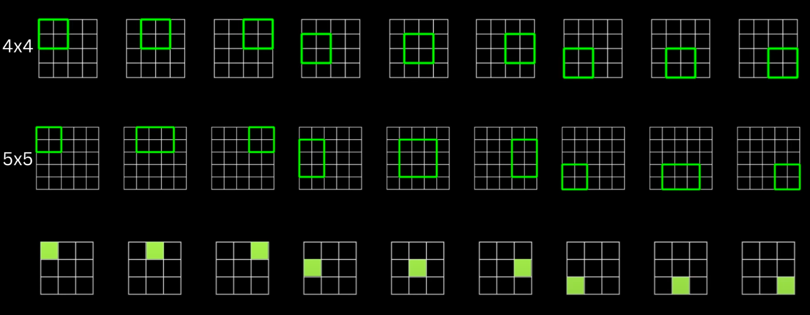
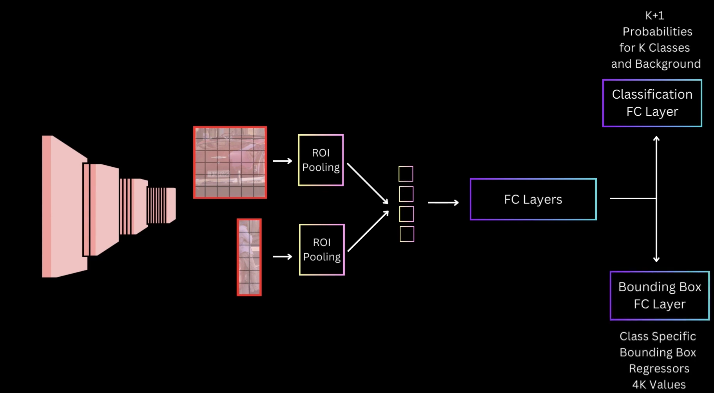
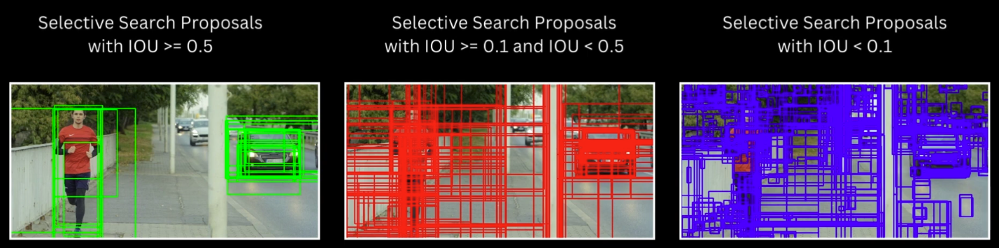
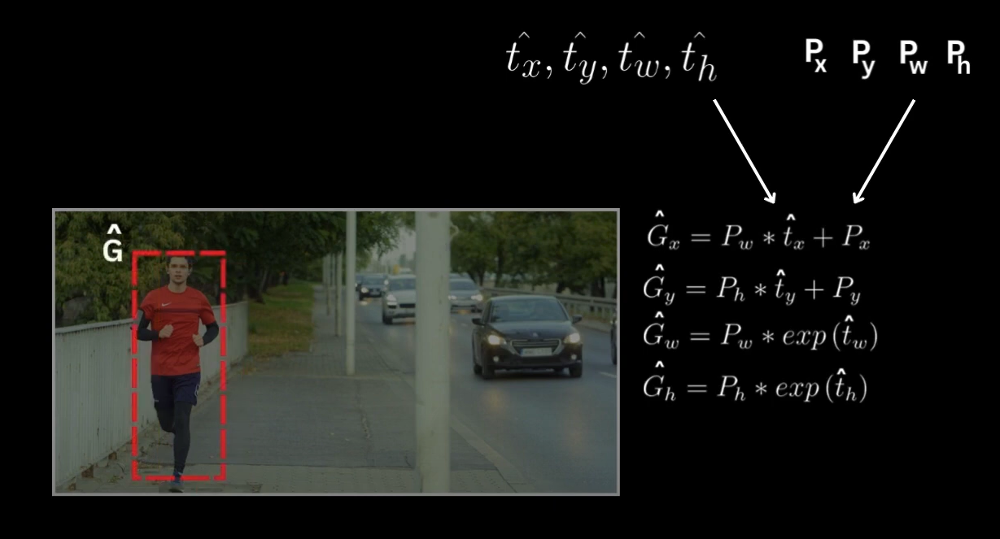

# Fast R-CNN: Fast Region-based Convolutional Neural Networks

Fast R-CNN (Girshick, 2015) is a significant improvement over the original R-CNN approach. It retains R-CNN’s core idea of combining region proposals with convolutional networks for object detection, but it **dramatically speeds up** both training and inference.

## Limitations of R-CNN

Recall that in R-CNN, each of the ~2,000 region proposals is processed *individually* by a convolutional network. This leads to:

1. **High computational cost**: Each proposal undergoes a forward pass, resulting in large inference times (tens of seconds per image).

2. **Complex multi-stage pipeline**: R-CNN requires:
   - Pre-training a CNN on ImageNet,
   - Fine-tuning the CNN for detection,
   - Training linear SVMs for classification,
   - Training regressors for bounding box refinement,
   - Caching features to disk (massive storage needs).

To address these inefficiencies, Ross Girshick introduced **Fast R-CNN**, which reuses the feature map computation for **all** proposals in a single pass, and trains classification and bounding box regression *jointly*.

## Fast R-CNN Architecture Overview

1. **Single shared convolutional pass**: Instead of cropping each region proposal from the original image and running it through the CNN thousands of times, Fast R-CNN:
   - Processes the *entire image* once through a CNN, producing a **feature map**.
   - Avoids repeated computation for overlapping regions.

2. **ROI Pooling**: Each region proposal is projected onto the feature map, and a special pooling layer—**ROI Pooling**—extracts a fixed-size feature vector for each proposal.

3. **Fully Connected Layers**: The pooled feature vectors are fed into fully connected layers that produce:
   - **K+1 class scores** (for K object classes plus background),
   - **4K bounding box regressions** (4 for each of the K classes).

4. **Single-stage training**: Classification and bounding box regression share the same convolutional features and are learned together with a single unified loss.

## ROI Pooling

A key innovation in Fast R-CNN is **Region of Interest (ROI) Pooling**. This layer takes the feature map (produced by the last convolutional layer) and a proposed bounding box, and outputs a fixed spatial resolution (e.g., 7×7).

1. **Projecting the ROI**: Each ROI—originally defined in image coordinates—is mapped to coordinates on the feature map.  
2. **Dividing into subregions**: Fast R-CNN splits the ROI into a defined grid (e.g., 7×7).  
3. **Max Pooling**: In each sub-bin, we apply a max-pooling operation to transform a variable-sized ROI into a fixed-sized feature.

This process enables the network to handle region proposals of varying shapes and sizes, while still outputting a fixed-size representation for each region proposal.

## Detailed Architecture

1. **Input**: An entire image is fed into the backbone CNN (e.g., VGG16, ResNet), generating a convolutional feature map.  
2. **Region Proposals**: ~2,000 candidate regions are projected onto this feature map.  
3. **ROI Pooling**: Each ROI is pooled into a fixed dimension (e.g., 7×7).  
4. **FC Layers**: The pooled features go through fully connected layers (often two), resulting in a 4096-dimensional vector (if using VGG16).  
5. **Output**:
   - **Classification Head** (K+1 outputs for classes & background)
   - **Bounding Box Regressor** (4K outputs for bounding box corrections)

Below is a schematic showing how the feature map is reused, then ROI-pooled, then split into separate heads for classification and box regression:

## Fast R-CNN Training

Fast R-CNN uses a **multi-task loss** that jointly trains classification (which class does this ROI contain?) and bounding box regression (how do we adjust the ROI to better fit the object?).

### 1. Classification Loss

For each ROI, let $\mathbf{p} = (p_0, p_1, \ldots, p_K)$ be the predicted probability distribution over the $K+1$ classes (with index 0 for background). Let $u$ be the ground-truth class label (where $u = 0$ indicates background). We use a standard cross-entropy loss:

$$
L_{\text{cls}}(\mathbf{p}, u) = -\log p_u.
$$

### 2. Bounding Box Regression

For each ROI labeled with a foreground class $u \ge 1$, Fast R-CNN learns class-specific bounding box offsets $\hat{t}^{u} = (\hat{t}_x, \hat{t}_y, \hat{t}_w, \hat{t}_h)$. Let $\mathbf{t}^{*}$ be the ground-truth offsets relative to the proposal. The regression loss is only activated if $u \ge 1$; otherwise, it’s zero:

$$
L_{\text{loc}}\bigl(\hat{\mathbf{t}}^u, \mathbf{t}^{*}\bigr)
= \sum_{i \in \{x,y,w,h\}} \text{smooth}_{L_1}\bigl(\hat{t}_i - t_i^*\bigr),
$$

where $\text{smooth}_{L_1}$ is:
$$
\text{smooth}_{L_1}(x) = 
\begin{cases}
0.5x^2 & \text{if } |x| < 1,\\
|x| - 0.5 & \text{otherwise}.
\end{cases}
$$

### 3. Combined Multi-Task Loss

The total loss for each ROI is:

$$
L(\mathbf{p}, u, \hat{\mathbf{t}}^u, \mathbf{t}^{*})
= L_{\text{cls}}(\mathbf{p}, u) + \lambda \cdot \mathbf{1}_{\{u \ge 1\}} \, L_{\text{loc}}\bigl(\hat{\mathbf{t}}^u, \mathbf{t}^{*}\bigr),
$$

where $\mathbf{1}_{\{u \ge 1\}}$ indicates bounding box regression is only considered for foreground classes, and $\lambda$ is a hyperparameter (often = 1).

## Training Details

- **End-to-End**: Fast R-CNN supports joint optimization of both classification and bounding box regression in *one* training stage, unlike the separate SVM and bounding box regression steps in R-CNN.
- **Mini-batch**: A single image forms a mini-batch (often), with ~64 or 128 ROIs per image.  
- **Positive/Negative Sampling**:  
  - Positive samples have an IoU ≥ 0.5 with a ground-truth box.  
  - Negative samples are those with 0.1 < IoU < 0.5, labeled as background.

---

## Bounding Box Regression (Transformations)

For a ROI $P = (P_x, P_y, P_w, P_h)$ and a ground-truth box $G = (G_x, G_y, G_w, G_h)$, Fast R-CNN learns the **transformation parameters**:

$$
t_x^* = \frac{G_x - P_x}{P_w}, \quad
t_y^* = \frac{G_y - P_y}{P_h}, \quad
t_w^* = \ln\Bigl(\tfrac{G_w}{P_w}\Bigr), \quad
t_h^* = \ln\Bigl(\tfrac{G_h}{P_h}\Bigr).
$$

In the forward pass, the model outputs $\hat{t}_x, \hat{t}_y, \hat{t}_w, \hat{t}_h$. These are converted back into bounding box coordinates by:

$$
\hat{G}_x = P_w \cdot \hat{t}_x + P_x, \quad
\hat{G}_y = P_h \cdot \hat{t}_y + P_y,
$$
$$
\hat{G}_w = P_w \cdot \exp(\hat{t}_w), \quad
\hat{G}_h = P_h \cdot \exp(\hat{t}_h).
$$

## Practical Gains of Fast R-CNN

- **Speed**: Inference time can drop from ~47s/image (R-CNN) to <0.5s/image on a GPU.
- **Single Training Stage**: Eliminates the need for separate SVM classification and bounding box regression training.
- **Memory & Storage**: No more caching features for thousands of proposals.

## Conclusion

Fast R-CNN addressed the major bottlenecks of R-CNN by **sharing convolutional computations** for all proposals, and by introducing the **ROI Pooling** layer that outputs a fixed-size feature for each region. This design:

- Greatly **accelerated** both training and inference,  
- Simplified the **pipeline** into a single-stage, end-to-end model,  
- Kept **accuracy** competitive or superior to R-CNN.

Fast R-CNN paved the way for further improvements, culminating in **Faster R-CNN**, which replaced the external region proposal stage with a learnable region proposal network, pushing detection toward real-time performance.

## References

- Girshick, R. (2015). **Fast R-CNN**. *IEEE International Conference on Computer Vision (ICCV)*, 1440–1448.  
- Girshick, R., Donahue, J., Darrell, T., & Malik, J. (2014). **Rich feature hierarchies for accurate object detection and semantic segmentation**. *CVPR*, 580–587.