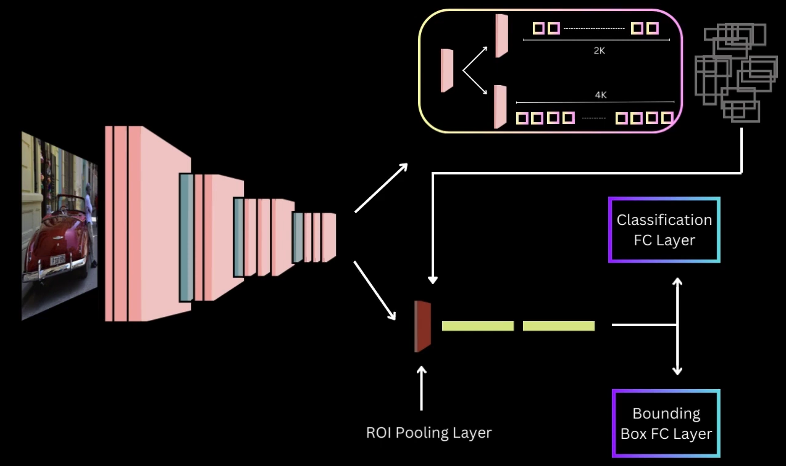

# Faster R-CNN

## Introduction

Faster R-CNN is one of the most influential deep learning architectures for object detection. Published in 2015 by Shaoqing Ren, Kaiming He, Ross Girshick, and Jian Sun, it represents a significant milestone in the evolution of object detection systems. 

At its core, Faster R-CNN integrates two networks:
- A deep convolutional neural network that proposes regions (Region Proposal Network or RPN)
- A Fast R-CNN detector that uses the proposed regions

What makes Faster R-CNN particularly remarkable is that it's an end-to-end trainable object detection system that achieves state-of-the-art accuracy while enabling near real-time detection speeds.

The fundamental innovation of Faster R-CNN is replacing the slow selective search algorithm (used in previous R-CNN models) with a neural network-based approach for generating region proposals, dramatically speeding up the detection process.

## Need for Faster R-CNN

To understand why Faster R-CNN was needed, we should look at the evolution of the R-CNN family:

### R-CNN (2014)
The original R-CNN used a selective search algorithm to extract about 2.000 region proposals from each image. Each region was then processed independently through a CNN. This approach suffered from:
- Very slow training and inference (Tens of seconds per image)
- Multi-stage pipeline (CNN feature extraction, SVM classification, bounding box regression)
- High storage requirements for features

### Fast R-CNN (2015)
Fast R-CNN improved on the original by:
- Processing the entire image once through a CNN
- Using RoI (Region of Interest) pooling to extract features for each region proposal
- Integrating classification and bounding box regression into a single network

While Fast R-CNN was significantly faster than R-CNN (0.3s per image excluding region proposal time), it still relied on the slow selective search algorithm for region proposals, which became the computational bottleneck, taking approximately 2 seconds per image.

### The Bottleneck Problem
In both R-CNN and Fast R-CNN, the region proposal step was separate from the neural network training. This separation meant:
1. Region proposals were computationally expensive
2. Region proposals couldn't be optimized end-to-end with the detector
3. The system couldn't utilize GPU acceleration for the entire pipeline

Faster R-CNN was designed specifically to address these limitations by making region proposal generation a part of the neural network itself.

## Region Proposal Network (RPN) in Faster RCNN

The Region Proposal Network is the key innovation in Faster R-CNN. It's a fully convolutional neural network that simultaneously predicts object bounds and objectness scores at each position.

### RPN Architecture

The RPN takes an image (of any size) as input and outputs a set of rectangular object proposals, each with an objectness score (the probability that a proposal contains an object versus background).

The process works as follows:

1. The entire image is first processed through a set of convolutional layers (typically a pre-trained network like VGG or ResNet) to produce a feature map.

2. A small network slides over the convolutional feature map (the last shared convolutional layer).

3. At each sliding window location, multiple region proposals (anchors) are predicted simultaneously.

4. For each anchor, the RPN outputs:
   - A binary classification output: object vs. not object (objectness score)
   - Bounding box regression offsets for refining the anchor coordinates

### Mathematical Representation

Let's dive deeper into the sliding window operation:

At each sliding window location, the RPN considers $k$ anchor boxes (default is 9, with 3 scales and 3 aspect ratios). For each anchor box, the RPN predicts:

- A binary classification score (is there an object or not?)
- 4 regression values for bounding box refinement

For a convolutional feature map of size W×H, the RPN outputs approximately:
- W×H×k binary classification scores
- W×H×k×4 bounding box regression values

Mathematically, for a convolutional feature map of W×H and k anchors per location, the RPN outputs k(W×H) potential region proposals. However, most of these will be filtered out based on objectness scores and non-maximum suppression.

The sliding window operation is implemented efficiently using two 1×1 convolutional layers:
- A classification layer (cls layer) that outputs 2k scores (objectness for k boxes)
- A regression layer (reg layer) that outputs 4k values (box coordinates for k boxes)

<!---
{width=50% .center}
-->

## Anchor Boxes in Faster RCNN

Anchors are a set of predefined bounding boxes with specific scales and aspect ratios that serve as reference boxes for detection.

### Key Properties of Anchors

1. **Translation Invariance**: Anchors ensure that predictions don't depend on object location. If an object moves within an image, the same prediction should be made relative to the new position.

2. **Multiple Scales and Aspect Ratios**: Objects in images can have different sizes and shapes. By using multiple anchors, the network can better detect objects of varying dimensions.

3. **Dense Coverage**: Anchors densely cover the spatial extent of the image, enabling detection of objects anywhere in the image.

### Standard Configuration

In the original Faster R-CNN paper, 9 anchor boxes are used at each sliding position, combining:
- 3 scales: $128^2$, $256^2$, $512^2$ pixels
- 3 aspect ratios: 1:1, 1:2, 2:1

This gives us the following anchor boxes: (128×128), (128×256), (256×128), (256×256), (256×512), (512×256), (512×512), (512×1024), (1024×512).

### Anchor Box Formulation

Mathematically, if ($x_a, y_a, w_a, h_a$) represents the center coordinates, width, and height of an anchor box, then the RPN predicts four parameters ($t_x, t_y, t_w, t_h$) which are used to transform the anchor box into a predicted bounding box ($x, y, w, h$) as follows:

$$
\begin{aligned}
x &= x_a + w_a \cdot t_x\\
y &= y_a + h_a \cdot t_y\\
w &= w_a \cdot \exp(t_w)\\
h &= h_a \cdot \exp(t_h)\\
\end{aligned}
$$
These transformations allow the network to predict offsets relative to anchor boxes, making the prediction more manageable than predicting absolute coordinates.

## Anchors to Proposals in Region Proposal Network

The RPN generates region proposals through several steps:

### Generating Anchor Boxes

For each location on the feature map, the RPN generates k anchor boxes (typically 9) with different scales and aspect ratios.

### Predicting Objectness Scores and Box Refinements

For each anchor box, the RPN predicts:
- An objectness score (probability of being an object)
- Four coordinate refinements ($t_x, t_y, t_w, t_h$)

### Applying Bounding Box Regression

The predicted refinements are applied to transform the anchor boxes into more precise region proposals using the formulas in the previous section.

### Filtering Proposals

Not all proposals are useful. The RPN filters them through:

**a. Score Thresholding**: Proposals with objectness scores below a threshold (e.g., 0.7) are discarded.

**b. Non-Maximum Suppression (NMS)**: This reduces redundancy by:
- Sorting all proposals by their objectness score
- Selecting the highest scoring proposal and removing all other proposals with IoU (Intersection over Union) greater than a threshold (e.g., 0.7)
- Repeating until no proposals remain

The IoU between two boxes is calculated as:

$IoU(A, B) = \frac{Area(A \cap B)}{Area(A \cup B)}$

Where:
- $A \cap B$ is the intersection area of boxes A and B
- $A \cup B$ is the union area of boxes A and B

### Limiting the Number of Proposals

After filtering, the top N (e.g., 300) proposals with the highest objectness scores are kept for the detection stage.

## RPN + Fast R-CNN

After the RPN generates region proposals, these proposals are fed into a Fast R-CNN detector for final classification and bounding box refinement.

### Integration Process

1. **Feature Sharing**: Both the RPN and Fast R-CNN share the same convolutional layers, reducing computation.

2. **RoI Pooling**: For each region proposal, features are extracted using RoI (Region of Interest) pooling from the same feature map used by the RPN.
   
   RoI pooling works by:
   - Dividing each region proposal into a grid of sub-windows (e.g., 7×7)
   - Max-pooling each sub-window to produce a fixed-size feature map
   - This ensures that regardless of the proposal's size, a fixed-length feature vector is produced

3. **Classification and Regression**: The pooled features are passed through fully connected layers for:
   - Classification into specific object classes (e.g., person, car, dog)
   - Further bounding box regression to refine the locations

### Mathematical Formulation

For each RoI (Region of Interest), Fast R-CNN outputs:
- A discrete probability distribution $p = (p_0, p_1, ..., p_K)$ over K+1 categories (K object classes plus background)
- Class-specific bounding box regression offsets $t^k = (t^k_x, t^k_y, t^k_w, t^k_h)$ for each of the K object classes

The loss function for training combines classification and regression losses:

$L(p, u, t^u, v) = L_{cls}(p, u) + \lambda [u \geq 1] L_{reg}(t^u, v)$

Where:
- $L_{cls}(p, u) = -\log p_u$ is the classification log loss for the true class u
- $L_{reg}$ is the smooth L1 loss for bounding box regression
- $[u \geq 1]$ is an indicator function (equals 1 when u ≥ 1, i.e., not background)
- $\lambda$ is a balancing parameter

## Training Region Proposal Network

The RPN is trained with a multi-task loss function that combines classification (objectness) and regression (bounding box) losses.

### Anchor Assignment

Before training, anchors need to be assigned as positive or negative examples:
- **Positive anchors**:
  - Anchors with the highest IoU overlap with a ground-truth box, or
  - Anchors with an IoU overlap higher than a threshold (e.g., 0.7) with any ground-truth box
- **Negative anchors**:
  - Anchors with IoU overlap lower than a threshold (e.g., 0.3) with all ground-truth boxes
- **Neutral anchors**:
  - Anchors that are neither positive nor negative do not contribute to the training objective

### Loss Function

The RPN's loss function is similar to that of Fast R-CNN:

$L(\{p_i\}, \{t_i\}) = \frac{1}{N_{cls}} \sum_i L_{cls}(p_i, p_i^*) + \lambda \frac{1}{N_{reg}} \sum_i p_i^* L_{reg}(t_i, t_i^*)$

Where:
- $i$ is the index of an anchor
- $p_i$ is the predicted probability of anchor i being an object
- $p_i^*$ is the ground-truth label (1 for positive anchors, 0 for negative)
- $t_i$ is the predicted bounding box coordinates
- $t_i^*$ is the ground-truth box coordinates
- $L_{cls}$ is the log loss over two classes (object vs. not object)
- $L_{reg}$ is the smooth L1 loss function
- $N_{cls}$ and $N_{reg}$ are normalization terms
- $\lambda$ is a balancing parameter (default is 10)

### Mini-batch Sampling

During training, a mini-batch consists of positive and negative examples:
- Typically 256 anchors per image
- Positive:Negative ratio of 1:1 if possible
- If an image has fewer than 128 positive anchors, more negative anchors are used

## Why Have Both RPN and Fast R-CNN

The design of Faster R-CNN with separate RPN and Fast R-CNN components might seem redundant since both networks perform bounding box regression and classification. However, this design offers several advantages:

### Specialized Tasks

- **RPN**: Focuses solely on distinguishing objects from background (binary classification) and generating coarse region proposals. It's optimized to have high recall (find all potential objects).

- **Fast R-CNN**: Performs fine-grained classification among multiple object classes and further refines bounding box locations. It's optimized for precision.

### Hierarchical Detection

The two-stage approach implements a coarse-to-fine detection strategy:
- First stage (RPN): Rapidly reduces the search space from millions of possible locations to a few hundred proposals
- Second stage (Fast R-CNN): Focuses computational resources on these promising regions

### Improved Performance

Empirically, the two-stage approach outperforms single-stage detectors in accuracy, especially for small objects. The separation allows each network to specialize in its task.

### Computational Efficiency

While having two networks might seem less efficient, the shared convolutional features significantly reduce computation. Additionally, the RPN's ability to quickly filter out most of the image space as background makes the overall system more efficient than examining all possible regions.

## Joint Training of Faster R-CNN

The original Faster R-CNN paper proposed several approaches for training the combined system. The primary challenge was how to train the shared convolutional layers that serve both the RPN and the Fast R-CNN detector.

### 4-Step Training Process

The recommended approach was a 4-step training process:

1. **Train RPN**: Train the RPN on the pretrained ImageNet model.

2. **Train Fast R-CNN**: Train a separate Fast R-CNN detection network using the proposals generated by the RPN from step 1. At this point, the networks don't share convolutional layers.

3. **Initialize Faster R-CNN**: Initialize the RPN with the detector network weights, but fix the shared convolutional layers. Only fine-tune the unique layers of the RPN.

4. **Fine-tune Fast R-CNN**: Keeping the shared convolutional layers fixed, fine-tune the unique layers of the Fast R-CNN detector.

This process ensures that both networks are trained properly while learning a shared representation in the convolutional layers.

## Alternate Training of Faster RCNN

A more streamlined approach for training Faster R-CNN is the alternating training method, which was also proposed in the original paper.

### Alternating Training Process

1. **Initialize with Pre-trained Network**: Start with a network pre-trained on ImageNet (e.g., VGG, ResNet).

2. **Train RPN**: Fine-tune the RPN using the pre-trained network.

3. **Generate Proposals**: Use the trained RPN to generate region proposals.

4. **Train Fast R-CNN**: Train the Fast R-CNN detector using the proposals from step 3, with the same pre-trained network as initialization.

5. **Re-initialize RPN**: Initialize the RPN with the weights from the detector network, but fix the shared convolutional layers.

6. **Iterative Training**: Repeat steps 3-5 as desired.

This alternating training approach is simpler than the 4-step process and converges after a couple of iterations. It's often referred to as "approximate joint training."

## Results for Object Detection Using Faster R-CNN

The original Faster R-CNN paper reported impressive results on benchmark datasets. Let's look at some key findings:

### PASCAL VOC Results

On the PASCAL VOC 2007 test set:
- Faster R-CNN with VGG-16: 73.2% mAP (mean Average Precision)
- Compared to Fast R-CNN with VGG-16: 70.0% mAP

On the PASCAL VOC 2012 test set:
- Faster R-CNN with VGG-16: 70.4% mAP

### MS COCO Results

The performance on the more challenging MS COCO dataset also showed state-of-the-art results at the time of publication.

### Speed Comparisons

One of the most significant improvements was in detection speed:
- Original R-CNN: ~47 seconds per image
- Fast R-CNN: ~2.3 seconds per image (including region proposal time)
- Faster R-CNN: ~0.2 seconds per image

This represented a 10x speedup compared to Fast R-CNN and made near real-time object detection possible.

### Impact of Anchors

The paper demonstrated that using multiple scales and aspect ratios for anchors significantly improved detection performance, particularly for objects of varying sizes.

### Ablation Studies

The ablation studies in the paper showed that:
- Joint training slightly improved performance over alternating training
- The RPN significantly improved proposal quality compared to selective search
- Sharing convolutional features between RPN and Fast R-CNN was both efficient and effective

## Difference Between RCNN, Fast RCNN, and Faster RCNN

Let's compare the three generations of R-CNN models:

### R-CNN (2014)

**Workflow**:
1. Extract ~2000 region proposals using selective search
2. Resize each proposal to a fixed size
3. Feed each proposal through a CNN independently
4. Classify each region with class-specific SVMs
5. Perform bounding box regression for refinement

**Limitations**:
- Very slow (84s per image)
- Multi-stage training (separate SVM classifiers, bounding box regressors)
- High storage requirements
- No end-to-end training

### Fast R-CNN (2015)

**Workflow**:
1. Process the entire image through a CNN to generate a feature map
2. Extract region proposals using selective search on the original image
3. Apply RoI pooling to extract fixed-size features for each proposal
4. Pass these features through fully connected layers
5. Use softmax classification and bounding box regression in a single network

**Improvements over R-CNN**:
- Much faster training and testing (0.3s per image excluding proposal generation)
- Higher detection accuracy
- End-to-end training with a multi-task loss
- No disk storage needed for features

**Limitations**:
- Still relies on external region proposals (selective search)
- Region proposal generation is a bottleneck (~2s per image)

### Faster R-CNN (2015)

**Workflow**:
1. Process the entire image through a CNN to generate a feature map
2. Apply a Region Proposal Network (RPN) to generate region proposals
3. Apply RoI pooling to extract fixed-size features for each proposal
4. Pass these features through fully connected layers
5. Use softmax classification and bounding box regression

**Improvements over Fast R-CNN**:
- Near real-time performance (~0.2s per image)
- Higher accuracy than Fast R-CNN
- Truly end-to-end trainable object detection system
- Region proposals integrated into the network

**Key Innovations**:
- Region Proposal Network (RPN)
- Anchor boxes for handling multiple scales and aspect ratios
- Shared convolutional features between RPN and detector
- Joint training methods

### Comparison Table

| Feature                | R-CNN            | Fast R-CNN                | Faster R-CNN                    |
| ---------------------- | ---------------- | ------------------------- | ------------------------------- |
| Region Proposal Method | Selective Search | Selective Search          | Region Proposal Network         |
| Feature Extraction     | Per Region       | Single Image Forward Pass | Single Image Forward Pass       |
| End-to-End Training    | No               | Yes                       | Yes                             |
| Detection Speed        | ~47s             | ~2.3s                     | ~0.2s                           |
| Storage Requirements   | High             | Low                       | Low                             |
| Network Architecture   | CNN + SVM        | Single Network            | Dual Network (RPN + Fast R-CNN) |
| Training Complexity    | High             | Medium                    | Medium-High                     |

## Conclusion

Faster R-CNN represents a significant advancement in object detection technology. By integrating the region proposal mechanism into the neural network itself, it addressed the major bottleneck in previous detection systems and enabled near real-time performance while maintaining high accuracy.

The key innovations of Faster R-CNN—particularly the Region Proposal Network and the concept of anchor boxes—have influenced many subsequent object detection architectures. Even as newer architectures like YOLO and SSD have emerged with different approaches to object detection, the principles established by Faster R-CNN continue to be relevant in the field.

The two-stage detection paradigm introduced by Faster R-CNN (proposing regions, then classifying them) remains a powerful approach, especially for applications where accuracy is more critical than speed. The flexibility to use different backbone networks (like ResNet, VGG, or Inception) further extends the utility of the Faster R-CNN architecture.

In summary, Faster R-CNN stands as one of the most important milestones in the evolution of deep learning-based object detection systems and continues to be a reference point for new developments in the field.