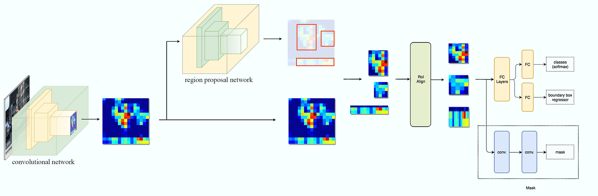
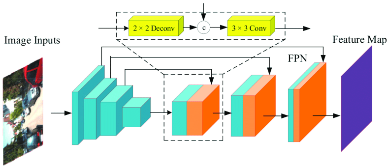

# Mask R-CNN: A Comprehensive Guide

## Introduction

Mask R-CNN (Mask Region-based Convolutional Neural Network) is a state-of-the-art framework for instance segmentation, published by Kaiming He, Georgia Gkioxari, Piotr Dollár, and Ross Girshick from Facebook AI Research (FAIR) in 2017. It extends the Faster R-CNN model by adding a branch for predicting segmentation masks in parallel with the existing branches for classification and bounding box regression.

While Faster R-CNN answers the questions "What objects are in the image and where are they located?", Mask R-CNN goes a step further by answering "What pixels belong to each object?" This pixel-level segmentation provides much more detailed information about the shape, size, and boundaries of objects compared to bounding boxes.

The elegance of Mask R-CNN lies in its simplicity and flexibility. It effectively adds minimal overhead to Faster R-CNN, making it an efficient and powerful tool for instance segmentation tasks.

## What is Instance Segmentation?

Before diving into Mask R-CNN, it's important to understand what instance segmentation actually means and how it differs from other computer vision tasks:

### Object Detection vs. Semantic Segmentation vs. Instance Segmentation

1. **Object Detection**: Identifies objects in an image and locates them with bounding boxes. Example: "There's a car at coordinates (x,y,w,h)."

2. **Semantic Segmentation**: Classifies each pixel in an image into a specific category. However, it doesn't distinguish between different instances of the same class. Example: "These pixels are car, these are road, these are pedestrian."

3. **Instance Segmentation**: Combines object detection and semantic segmentation. It identifies individual objects (instances) and provides pixel-level masks for each instance. Example: "Car #1 consists of these pixels, and Car #2 consists of those pixels."

Instance segmentation is particularly valuable in applications that require precise object boundaries, such as autonomous driving, robotics, medical image analysis, and computational photography.

## Mask R-CNN Architecture Overview

Mask R-CNN builds directly on the Faster R-CNN architecture, which you're already familiar with from your notes. It adds a new branch to predict segmentation masks for each Region of Interest (RoI), parallel to the existing branches for classification and bounding box regression.

The overall architecture of Mask R-CNN consists of the following components:

1. **Backbone Network**: A convolutional network (typically ResNet50 or ResNet101) responsible for feature extraction from the input image.

2. **Region Proposal Network (RPN)**: Proposes candidate object bounding boxes (regions of interest).

3. **RoIAlign Layer**: A critical improvement over RoIPool in Faster R-CNN, designed to preserve spatial information.

4. **Network Head**: Contains three parallel branches:
   - Classification branch: Predicts the class of the object
   - Bounding box regression branch: Refines the bounding box coordinates
   - Mask prediction branch: Predicts binary masks for each RoI

Let's explore each of these components in detail.

## Key Innovations in Mask R-CNN

### 1. RoIAlign: Improving Spatial Accuracy

One of the most significant contributions of Mask R-CNN is the introduction of the RoIAlign layer, which addresses a fundamental limitation of the RoIPool layer used in Faster R-CNN.

#### The Problem with RoIPool

In Faster R-CNN, the RoIPool operation first quantizes (rounds) the floating-point coordinates of the proposed regions to integers. This quantization introduces misalignments between the RoI features and the input image. While this misalignment might be tolerable for classification and coarse bounding box regression, it significantly impacts the accuracy of pixel-level mask predictions.

#### How RoIAlign Solves This

RoIAlign uses bilinear interpolation to compute the exact values of the input features at four regularly sampled locations in each RoI bin and then aggregates the result (using max or average pooling). This avoids any quantization of the RoI boundaries or bins.

Mathematically, for a point (x, y) in the feature map, bilinear interpolation computes:

$$f(x,y) = \sum_{i,j} f(i,j) \max(0, 1-|x-i|) \max(0, 1-|y-j|)$$

Where (i, j) are the integer coordinates of the four nearest pixels to (x, y).

The RoIAlign process:
1. Divides the RoI into a grid of bins (e.g., 7×7 for classification, 14×14 for mask prediction)
2. For each bin, computes a fixed number of sampling points (typically 4)
3. For each sampling point, calculates the interpolated values using bilinear interpolation
4. Aggregates the interpolated values (using max or average) to get the final output for each bin

This seemingly small change leads to significant improvements in mask accuracy, improving average precision by 10% to 50% relative to using RoIPool.

### 2. Mask Branch: Parallel Prediction

The second key innovation is the addition of a mask branch that runs in parallel with the existing classification and bounding box regression branches.

#### Branch Design

The mask branch is a small fully convolutional network (FCN) applied to each RoI, predicting a segmentation mask on a pixel-by-pixel basis. Specifically:

1. It takes features from the RoIAlign layer (typically 14×14 resolution)
2. Passes them through a series of convolutional layers (typically 4 convolutional layers with 256 filters each, followed by ReLU)
3. Applies a transposed convolution (deconvolution) layer to upsample the features to 28×28 resolution
4. Outputs an m-channel output where m is the number of classes (in the original implementation, though variants exist)

For each RoI, the mask branch generates m binary masks of size 28×28, one for each of the m classes. Only the mask corresponding to the predicted class from the classification branch is used.

#### FCN vs. Fully Connected Layers

A crucial design choice in Mask R-CNN is using a Fully Convolutional Network for the mask branch instead of fully connected (FC) layers. FCNs maintain spatial information throughout the network, which is essential for pixel-to-pixel tasks like segmentation. FC layers would flatten spatial information, making pixel-level prediction much harder.

### 3. Class-Specific Mask Prediction

Mask R-CNN decouples mask prediction from classification. Unlike methods that predict masks first and then classify them, Mask R-CNN:

1. Predicts a binary mask for each class (m masks in total)
2. Selects the mask corresponding to the class predicted by the classification branch

This decoupling simplifies training and improves performance by allowing the network to focus on generating good masks for each class without competing objectives.

## Mathematical Formulation of Loss Function

The multi-task loss function for Mask R-CNN extends the one used in Faster R-CNN by adding a mask loss term:

$$L = L_{cls} + L_{box} + L_{mask}$$

Where:
- $L_{cls}$ is the classification loss (log loss for the predicted class)
- $L_{box}$ is the bounding box loss (smooth L1 loss for the predicted box coordinates)
- $L_{mask}$ is the mask loss, defined below

### Mask Loss

The mask loss is defined as the average binary cross-entropy loss, computed only on the mask corresponding to the ground truth class:

$$L_{mask} = -\frac{1}{m^2} \sum_{1 \leq i,j \leq m} [y_{ij} \log \hat{y}_{ij}^c + (1-y_{ij}) \log (1-\hat{y}_{ij}^c)]$$

Where:
- $y_{ij}$ is the ground truth binary mask value at pixel (i,j)
- $\hat{y}_{ij}^c$ is the predicted mask value at pixel (i,j) for class c
- $m$ is the mask resolution (typically 28×28)
- c is the ground truth class for the RoI

Importantly, the mask loss is only defined on RoIs assigned to ground truth class c. For other RoIs, this loss is ignored. This enables the network to generate class-specific masks.

## Training Mask R-CNN

The training process for Mask R-CNN builds upon the approach used for Faster R-CNN, with a few key differences:

### Data Preparation

For training Mask R-CNN, each ground truth instance requires:
- A class label
- A bounding box
- A binary mask indicating which pixels belong to the instance

### Anchor Assignment

As in Faster R-CNN, anchors are assigned to ground truth objects based on IoU (Intersection over Union) thresholds. The difference is that each positive anchor now also needs a mask target in addition to class and box targets.

### Mini-batch Sampling

During training, each mini-batch typically consists of 2 images with 64 sampled RoIs per image (128 RoIs per mini-batch). These RoIs are assigned to ground truth objects or background using the same IoU thresholds as in Faster R-CNN.

### Training Schedule

Mask R-CNN training typically follows a two-stage approach:
1. **Initial Training**: The network is first trained on publicly available datasets (like COCO) with a backbone pretrained on ImageNet.
2. **Fine-tuning**: For specific applications, the model is fine-tuned on application-specific data.

The training schedule often involves:
- Starting with a lower learning rate (e.g., 0.001)
- Using learning rate decay when the validation loss plateaus
- Training for a large number of iterations (e.g., 160,000 for COCO)

### Data Augmentation

Various data augmentation techniques are employed:
- Random horizontal flipping
- Scale jittering
- Rotation
- Color augmentation
- Cropping

These help the model generalize better to new data and improve its robustness.

## Feature Pyramid Network (FPN) in Mask R-CNN

Many implementations of Mask R-CNN incorporate a Feature Pyramid Network (FPN) as the backbone architecture to improve detection of objects at different scales.

### FPN Concept

FPN addresses the challenge of detecting objects of various sizes by creating a pyramid of feature maps with different resolutions but semantically strong features at all levels.

The key insight of FPN is to combine high-resolution, semantically weak features from lower layers with low-resolution, semantically strong features from higher layers through a top-down pathway with lateral connections.

### FPN Architecture

The FPN architecture consists of:

1. **Bottom-up pathway**: The standard forward pass of the backbone network (e.g., ResNet), which computes feature hierarchies at multiple scales.

2. **Top-down pathway**: Upsampling of spatially coarser but semantically stronger features from higher pyramid levels.

3. **Lateral connections**: 1×1 convolutional layers that connect corresponding levels from the bottom-up and top-down pathways.

### Mathematical Representation

Let's denote the feature maps from the bottom-up pathway as {C2, C3, C4, C5}, corresponding to the outputs of the respective stages in ResNet (typically with strides of 4, 8, 16, and 32 pixels with respect to the input image).

The top-down pathway generates higher resolution features {P5, P4, P3, P2} as follows:

$$P_5 = \text{Conv}_{1 \times 1}(C_5)$$
$$P_4 = \text{Conv}_{1 \times 1}(C_4) + \text{Upsample}(P_5)$$
$$P_3 = \text{Conv}_{1 \times 1}(C_3) + \text{Upsample}(P_4)$$
$$P_2 = \text{Conv}_{1 \times 1}(C_2) + \text{Upsample}(P_3)$$

Where:
- $\text{Conv}_{1 \times 1}$ is a 1×1 convolutional layer that reduces the channel dimension
- $\text{Upsample}$ is a 2× upsampling operation, typically nearest neighbor or bilinear
- The addition is performed element-wise

Finally, a 3×3 convolution is applied to each merged map to generate the final feature map and reduce aliasing effects from upsampling:

$$P_i = \text{Conv}_{3 \times 3}(P_i)$$

### Benefits of FPN in Mask R-CNN

Incorporating FPN in Mask R-CNN offers several advantages:

1. **Multi-scale detection**: The pyramid structure allows the network to detect objects of varying sizes more effectively.

2. **Improved feature representation**: Features at all levels are semantically strong, benefiting both small and large object detection.

3. **Efficiency**: Despite creating multiple feature maps, FPN adds relatively little computational overhead because most computation is done on lower-resolution feature maps.

4. **Performance boost**: Using FPN typically improves both bounding box detection and mask segmentation accuracy, particularly for small objects.

## Inference in Mask R-CNN

During inference, Mask R-CNN follows these steps:

1. **Feature Extraction**: The input image is passed through the backbone network (possibly with FPN) to extract features.

2. **Region Proposal**: The RPN generates region proposals based on the feature maps.

3. **RoI Processing**: For each proposed region:
   - RoIAlign extracts fixed-size feature maps
   - The classification branch predicts the class
   - The box regression branch refines the bounding box
   - The mask branch generates masks for each class

4. **Post-processing**:
   - Non-maximum suppression (NMS) is applied to remove overlapping detections
   - For each remaining detection, the mask corresponding to the predicted class is selected
   - The mask is resized to the size of the predicted bounding box and thresholded (typically at 0.5) to create a binary mask

5. **Final Output**: The final output consists of:
   - Class labels
   - Confidence scores
   - Refined bounding boxes
   - Binary masks for each detected instance

### Mask Processing Details

The mask output from the network is a low-resolution (typically 28×28) mask for each class. To convert this to a full-resolution mask aligned with the input image:

1. Select the m×28×28 mask output for the predicted class m
2. Resize this mask to the size of the RoI using bilinear interpolation
3. Apply a threshold (typically 0.5) to create a binary mask
4. Place this mask within the image at the position of the predicted bounding box

## Results and Performance

Mask R-CNN demonstrated impressive results on the COCO dataset, a standard benchmark for instance segmentation:

### COCO Results

- **Average Precision (AP) for masks**: Mask R-CNN achieved 35.7% AP on the COCO test-dev dataset (as reported in the original paper).
- **AP for bounding boxes**: 38.2%, which is actually an improvement over Faster R-CNN, showing that the addition of the mask branch can help with bounding box detection.

### Speed-Accuracy Trade-off

Mask R-CNN maintains an efficient speed-accuracy trade-off:
- It runs at 5-10 FPS on a GPU (depending on the backbone network)
- The mask branch adds only a small computational overhead (~20%) over Faster R-CNN

### Implementation Considerations

Several factors affect the performance of Mask R-CNN:

1. **Backbone Architecture**: ResNet50 vs. ResNet101 vs. other variations
   - Deeper networks typically improve accuracy at the cost of speed

2. **Feature Pyramid Network**: With vs. without FPN
   - FPN generally improves performance, especially for multi-scale detection

3. **RoIAlign parameters**: Grid size, sampling points
   - Larger grid sizes and more sampling points improve mask quality but increase computation

4. **Training hyperparameters**: Learning rate, batch size, optimizer
   - These need to be tuned for specific datasets and applications

## Comparison with Other Instance Segmentation Methods

To understand Mask R-CNN's significance, let's compare it with other instance segmentation approaches:

### Traditional Two-Stage Approaches

Before Mask R-CNN, many instance segmentation methods followed a complex pipeline:
1. Generate region proposals
2. Classify regions
3. Apply separate segmentation algorithms (e.g., GrabCut) to each region

These methods were typically slow and not end-to-end trainable.

### FCN-based Approaches

Fully Convolutional Networks (FCNs) revolutionized semantic segmentation but struggled with instance segmentation because they don't distinguish between different instances of the same class.

### DeepMask and SharpMask

These approaches generated mask proposals first, then classified them. This differs from Mask R-CNN's approach of predicting class, box, and mask in parallel, which proved more effective.

### FCIS (Fully Convolutional Instance Segmentation)

FCIS attempted to address instance segmentation with a fully convolutional approach. However, it suffered from systematic errors on overlapping instances and complicated situations.

### Advantages of Mask R-CNN

Compared to these alternatives, Mask R-CNN offers:
- Simplicity: A straightforward extension of Faster R-CNN
- Flexibility: Can be applied with various backbone architectures
- Accuracy: State-of-the-art performance on benchmark datasets
- Generality: Can be extended to other tasks beyond instance segmentation

## Extensions and Variations of Mask R-CNN

Since its introduction, Mask R-CNN has inspired numerous extensions and variations:

### Mask Scoring R-CNN

Mask Scoring R-CNN (MS R-CNN) addresses the issue that the classification score doesn't always correlate well with mask quality. It adds a branch to predict the IoU between the predicted mask and the ground truth mask, providing a better measure of mask quality.

### PANet (Path Aggregation Network)

PANet enhances the FPN in Mask R-CNN by adding a bottom-up path augmentation, adaptive feature pooling, and fully-connected fusion. These improvements help better propagate low-level information throughout the network.

### Cascade Mask R-CNN

Cascade Mask R-CNN uses a sequence of detectors trained with increasing IoU thresholds, progressively refining the detection and mask prediction. This approach is particularly effective for high-quality instance segmentation.

### HTC (Hybrid Task Cascade)

Hybrid Task Cascade improves the cascading structure by introducing a more direct information flow between detection and segmentation, along with a semantic segmentation branch to provide spatial context.

### PointRend

PointRend combines the efficiency of FCNs with the effectiveness of point-based methods for segmentation. It iteratively refines the mask predictions by focusing on points where the segmentation boundaries are uncertain.

### Mask R-CNN with Transformer Backbones

Recent work has incorporated transformer-based architectures (like Swin Transformer) as the backbone for Mask R-CNN, achieving state-of-the-art performance with better feature representations.

## Mask R-CNN vs. Faster R-CNN: Key Differences

Now that we've explored Mask R-CNN in detail, let's summarize the key differences between Mask R-CNN and its predecessor, Faster R-CNN:

| Feature                | Faster R-CNN                                   | Mask R-CNN                                                         |
| ---------------------- | ---------------------------------------------- | ------------------------------------------------------------------ |
| Task                   | Object Detection                               | Instance Segmentation                                              |
| Output                 | Class labels + Bounding boxes                  | Class labels + Bounding boxes + Segmentation masks                 |
| RoI Layer              | RoIPool (quantized)                            | RoIAlign (bilinear interpolation)                                  |
| Network Head           | Two branches (classification + box regression) | Three branches (classification + box regression + mask prediction) |
| Loss Function          | $L = L_{cls} + L_{box}$                        | $L = L_{cls} + L_{box} + L_{mask}$                                 |
| Typical Backbone       | VGG, ResNet                                    | ResNet, ResNeXt, often with FPN                                    |
| Computational Overhead | Base reference                                 | ~20% more than Faster R-CNN                                        |
| Accuracy (COCO)        | ~36.8% AP (bounding boxes)                     | ~38.2% AP (bounding boxes), ~35.7% AP (masks)                      |

## Conclusion

Mask R-CNN represents a significant advancement in computer vision, extending object detection to pixel-level instance segmentation with minimal additional complexity. Its elegant design, which adds a mask branch parallel to the existing classification and bounding box regression branches of Faster R-CNN, along with the critical improvement of the RoIAlign layer, has made it a cornerstone of modern instance segmentation.