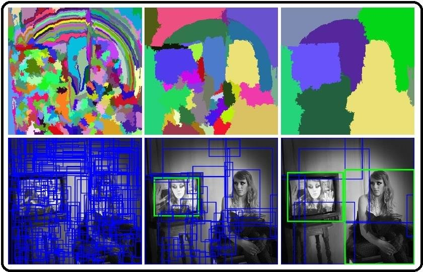
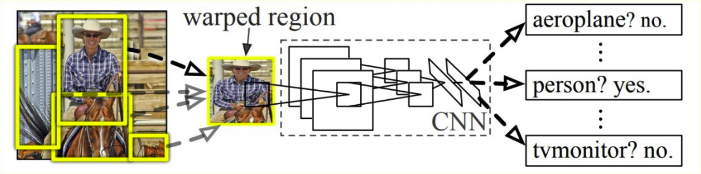

# R-CNN: Regions with Convolutional Neural Network Features

R-CNN (Region-based Convolutional Neural Network), introduced by Girshick et al. (2014), revolutionized object detection by combining region proposals with deep convolutional features. The architecture effectively detects and localizes objects in images by leveraging the representational power of CNNs.

## Core Concept and Workflow

The fundamental idea behind R-CNN is to:
1. Generate potential object regions within an image
2. Extract features from each region using a CNN
3. Classify each region and refine its spatial coordinates

### Region Proposal Generation

The process begins with generating region proposals—candidate bounding boxes potentially containing objects—using Selective Search. This algorithm:

- Treats each image as a graph where similar pixels and regions are iteratively merged
- Employs multiple complementary similarity measures (color, texture, size, and fill)
- Generates approximately 2,000 region proposals per image
- Creates a diverse set of candidate boxes at various scales and aspect ratios

<!---
"width=50% .center"
-->

### Feature Extraction with CNN

Once proposals are obtained, R-CNN:

1. Crops each region from the original image
2. Warps it to a fixed size (227×227 pixels for AlexNet)
3. Processes it through a pre-trained CNN
4. Extracts a 4096-dimensional feature vector from the penultimate fully-connected layer (typically fc7)

The CNN is first pre-trained on ImageNet classification, providing powerful initial weights. It's then fine-tuned specifically for detection by replacing the 1000-class classification layer with a new layer containing K+1 outputs (K object classes plus a background class).

### Training Process (Multi-stage)

R-CNN requires three distinct training phases:

1. **Pre-training**: Training the CNN on ImageNet classification data
2. **Fine-tuning**: Adapting the network for detection using object detection data
   - Proposals with IoU ≥ 0.5 with a ground-truth box are positive examples
   - Proposals with IoU < 0.5 are negative (background) examples
   - Loss function: log loss over K+1 classes
3. **Classifier Training**: Training K separate binary SVMs (one per class)
   - Uses hard negative mining to handle the class imbalance
   - Objective function: 
     $$\min_{w} \frac{1}{2} w^T w + C \sum_i \max(0, 1 - y_i w^T x_i)$$
     where $y_i \in \{-1, 1\}$ is the label and $x_i$ is the feature vector
4. **Bounding Box Regression**: Training a linear regressor for box refinement

### Intersection over Union (IoU)

The IoU metric is fundamental to R-CNN for evaluation and training. It measures the overlap between predicted and ground-truth boxes:

$$
\text{IoU}(B_{\text{pred}}, B_{\text{gt}}) = \frac{\mathrm{Area}\bigl(B_{\text{pred}} \cap B_{\text{gt}}\bigr)}{\mathrm{Area}\bigl(B_{\text{pred}} \cup B_{\text{gt}}\bigr)},
$$

where $B_{\text{pred}}$ is the predicted box and $B_{\text{gt}}$ is the ground-truth. A prediction is considered positive if IoU exceeds a threshold (typically 0.5).

### Bounding Box Regression

To improve localization accuracy, R-CNN learns a transformation from initial region proposals to more accurate bounding boxes. Given:
- Region proposal with center $(x_r, y_r)$ and size $(w_r, h_r)$
- Ground-truth box with center $(x_t, y_t)$ and size $(w_t, h_t)$

R-CNN learns four offsets:

$$
\begin{aligned}
d_x = \frac{x_t - x_r}{w_r}
\quad
d_y = \frac{y_t - y_r}{h_r}\\
d_w = \ln\bigl(\tfrac{w_t}{w_r}\bigr)
\quad
d_h = \ln\bigl(\tfrac{h_t}{h_r}\bigr)
\end{aligned}
$$

The regression loss function is:

$$L_{reg}(t, t^*) = \sum_{j \in \{x,y,w,h\}} \text{smooth}_{L1}(t^j - t^{*j})$$

where $\text{smooth}_{L1}$ is a robust L1 loss that is less sensitive to outliers.

During inference, the predicted offsets $\hat{d}_x, \hat{d}_y, \hat{d}_w, \hat{d}_h$ are converted back to actual coordinates:

$$
\hat{x} = \hat{d}_x \cdot w_r + x_r,
\quad
\hat{y} = \hat{d}_y \cdot h_r + y_r,
\quad
\hat{w} = \exp(\hat{d}_w) \cdot w_r,
\quad
\hat{h} = \exp(\hat{d}_h) \cdot h_r.
$$

### Non-Maximum Suppression (NMS)

To eliminate duplicate detections, R-CNN applies NMS:
1. Sort all detections by confidence score
2. Select the highest-scoring box and add it to the final detections
3. Remove all boxes with IoU > threshold (typically 0.3-0.5) with the selected box
4. Repeat steps 2-3 until no boxes remain

This ensures that each object receives only one detection.

<!---
{width=50% .center}
-->

## Performance and Limitations

### Performance Metrics
- Achieved 53.7% mean Average Precision (mAP) on PASCAL VOC 2010
- Represented a >30% relative improvement over previous state-of-the-art methods

### Computational Complexity
- Processing a single image takes approximately 47 seconds on a GPU
- Feature extraction accounts for the majority of this computation time
- The high computational cost stems from running the CNN separately on each of the ~2,000 region proposals

### Limitations
1. **Slow Training**: Three-stage pipeline is complex and time-consuming
2. **Slow Inference**: ~47 seconds per image makes real-time applications impossible
3. **Storage Requirements**: Features for thousands of regions must be cached to disk during training

These limitations motivated the development of more efficient architectures like Fast R-CNN, Faster R-CNN, and Mask R-CNN, which preserve R-CNN's accuracy while dramatically improving computational efficiency through shared computation and end-to-end training.

Despite its inefficiencies, R-CNN marked a paradigm shift in object detection, demonstrating how deep CNN features could be effectively repurposed for localization tasks beyond simple image classification.

## References

Girshick, R., Donahue, J., Darrell, T., & Malik, J. (2014). Rich feature hierarchies for accurate object detection and semantic segmentation. *Proceedings of the IEEE Conference on Computer Vision and Pattern Recognition (CVPR)*, 580-587.