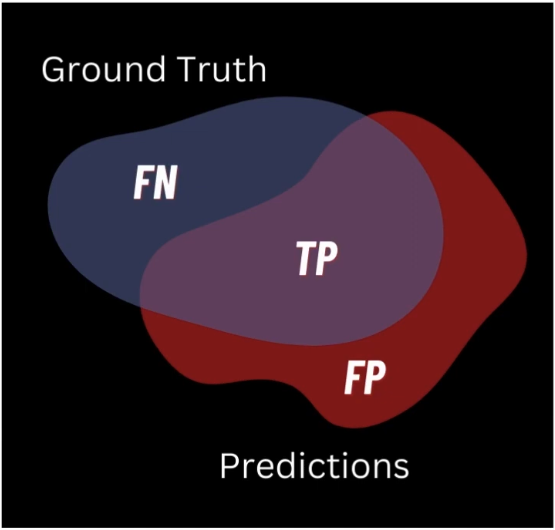
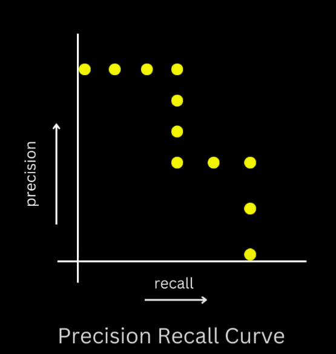

# Mean Average Precision (mAP) in Object Detection

Mean Average Precision (mAP) is the standard evaluation metric for object detection systems like R-CNN. 

## The Building Blocks: Precision and Recall

Before we can understand mAP, we need to understand precision and recall:

**Precision** answers: "Of all the objects I predicted, what fraction did I correctly identify?"
```
Precision = True Positives / (True Positives + False Positives)
```

**Recall** answers: "Of all the actual objects in the images, what fraction did I find?"
```
Recall = True Positives / (True Positives + False Negatives)
```


<!---
{width=50% .center}
-->

## What Makes Object Detection Evaluation Complex?

Object detection evaluation is tricky for several reasons:

1. We're not just classifying whole images but locating and classifying multiple objects
2. We need to decide when a detection is "correct" (using IoU thresholds)
3. Our detector produces confidence scores, creating a trade-off between precision and recall

## When is a Detection "Correct"?

A predicted bounding box is considered a true positive if:
1. It has the correct class label, AND
2. Its IoU with a ground-truth box exceeds a threshold (typically 0.5)

**Important**: Each ground-truth box can only be matched once. If multiple predictions overlap with the same ground-truth, only the one with highest confidence is considered correct; the others become false positives.

## Precision-Recall Curve

For a single class, we can create a precision-recall curve:

1. Gather all predictions and ground truths for this class:
   - Count the total number of ground truth objects ($N_{G}$)
   - Collect all predictions labeled as this class

2. Sort predictions by confidence score (from highest to lowest)

3. Process each prediction sequentially:

   - For each prediction, find the ground truth box of the same class with highest IoU
   - Apply the decision rule:
     - If IoU ≥ threshold (typically 0.5) AND this ground truth hasn't been matched before → True Positive
     - Otherwise → False Positive
   - Mark the matched ground truth as "already matched" so it can't be matched again
   - After each prediction, calculate cumulative counts:
     - TP_cumulative = running count of true positives so far
     - FP_cumulative = running count of false positives so far

4. Calculate precision and recall at each step:
   - Precision = TP_cumulative / (TP_cumulative + FP_cumulative)
   - Recall = TP_cumulative / $N_{G}$

5. Generate the precision-recall curve:
   - Each prediction adds a new point to our curve:
     - The x-coordinate is the recall
     - The y-coordinate is the precision


<!---
{width=50% .center}
-->

## Average Precision (AP) for a Single Class

Average Precision summarizes the precision-recall curve into a single value:

1. In the original formulation (used in PASCAL VOC until 2009):
   AP = average of precision values at 11 fixed recall points (0, 0.1, 0.2, ..., 1.0)

2. In the more recent and common approach (PASCAL VOC 2010 onward):
   AP = area under the precision-recall curve

To compute this area more reliably, we first apply a smoothing technique:
```
p_interp(r) = max(p(r')) where r' ≥ r
```

This replaces each precision value with the maximum precision for any higher recall value, creating a monotonically decreasing curve that's easier to integrate.

## Mean Average Precision (mAP)

Finally, mAP is simply the mean of the AP values across all classes:
```
mAP = (1/N) * sum(AP_i) for i from 1 to N classes
```

## Concrete Example

Imagine we have a dataset with cats and dogs:

1. Calculate AP for cats (let's say 0.65)
2. Calculate AP for dogs (let's say 0.82)
3. mAP = (0.65 + 0.82) / 2 = 0.735 or 73.5%

## Different mAP Variants

Different benchmarks use variations of mAP:

- **PASCAL VOC**: Typically uses IoU threshold of 0.5
- **COCO**: Reports multiple mAP values:
  - mAP@[.5] (IoU threshold = 0.5)
  - mAP@[.75] (IoU threshold = 0.75)
  - mAP@[.5:.95] (average over multiple IoU thresholds from 0.5 to 0.95 in steps of 0.05)

The COCO variant is more stringent and rewards detectors with more precise localizations.

## Why mAP is Valuable

mAP is widely used because it:
1. Considers both precision and recall
2. Evaluates performance across different confidence thresholds
3. Handles multiple classes effectively
4. Accounts for object localization quality
5. Provides a single number for ranking different detection systems

When R-CNN achieved 53.7% mAP on PASCAL VOC 2010, it meant that, on average across all classes, the area under its precision-recall curves was 0.537 (with IoU threshold of 0.5), representing a significant improvement over previous methods.

Understanding mAP helps you properly interpret object detection research papers and effectively compare different architectures like R-CNN, Fast R-CNN, and their successors.